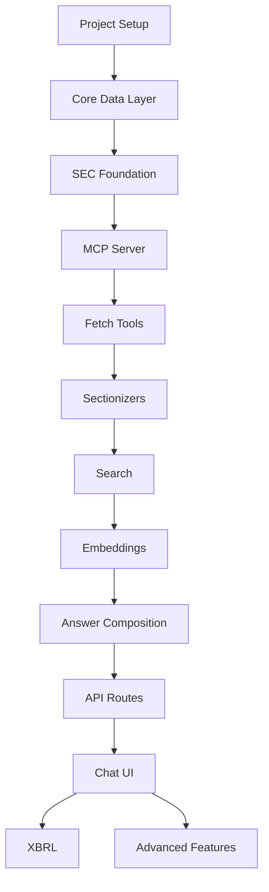

# EDGAR Answer Engine - Project Roadmap

## Project Overview

Build a cloud-hosted web application that answers natural language queries about SEC EDGAR filings with evidence-grounded citations, without mirroring EDGAR data.

### Core Principles
- **Accuracy first** - Every statement must be supported by retrieved evidence
- **No EDGAR mirroring** - Fetch on demand with short TTL caching
- **Tool-first orchestration** - LLM plans and composes; tools provide facts
- **Progressive results** - Stream partial results for broad scans
- **Compliance & respect** - Proper User-Agent, rate limiting, backoff

## Development Phases

### Foundation Phase
*Build once, never rebuild*

#### Phase 1.1: Project Setup & Infrastructure
**Duration**: 2-3 days

**Tasks**:
1. Initialize monorepo structure
   ```
   edgar-query/
   ├── apps/
   │   └── web/              # Next.js application
   ├── services/
   │   └── edgar-mcp/        # MCP server
   ├── packages/
   │   └── types/            # Shared TypeScript types
   ├── infra/                # Infrastructure configs
   └── package.json          # Root package.json
   ```

2. Setup Vercel project
   - Create new project linked to GitHub repo
   - Configure environment variables
   - Set Node.js runtime (not Edge)

3. Configure PostgreSQL with pgvector
   - Create Neon or Supabase database
   - Enable pgvector extension
   - Save connection string

4. Setup Upstash Redis
   - Create global Redis instance
   - Configure for rate limiting

5. Environment configuration
   ```env
   DATABASE_URL=
   REDIS_URL=
   USER_AGENT="EdgarAnswerEngine/1.0 (contact@example.com)"
   OPENAI_API_KEY= or ANTHROPIC_API_KEY=
   VERCEL_BLOB_READ_WRITE_TOKEN=
   ```

**Validation Gate**: 
- [ ] Deploy "hello world" endpoint that connects to all services
- [ ] Verify database connection
- [ ] Verify Redis connection
- [ ] Verify Blob storage access

#### Phase 1.2: Core Data Layer
**Duration**: 2-3 days

**Tasks**:
1. Design and implement database schema
   - Companies table
   - Filings table
   - Sections table
   - Chunks table with vector column
   - Answers table

2. Create shared type definitions
   - Zod schemas for validation
   - TypeScript interfaces
   - API contracts

3. Build SEC utilities
   - CIK padding functions
   - URL composition helpers
   - Accession number parsers

4. Implement rate limiter
   - Token bucket algorithm
   - Redis-backed
   - Configurable limits

**Validation Gate**:
- [ ] All database migrations run successfully
- [ ] Unit tests for utilities pass
- [ ] Rate limiter prevents >10 req/sec

#### Phase 1.3: SEC Data Foundation
**Duration**: 2-3 days

**Tasks**:
1. Build company resolver
   - Fetch and store ticker mappings
   - Implement ticker → CIK lookup
   - Handle name searches

2. Implement submissions fetcher
   - Proper User-Agent header
   - Parse submissions JSON
   - Map to internal types

3. Create retry/backoff mechanism
   - Exponential backoff
   - Handle 429/503 responses
   - Max retry limits

**Validation Gate**:
- [ ] Can resolve "AAPL" → CIK 0000320193
- [ ] Can fetch last 10 filings for any CIK
- [ ] Retry logic handles rate limits gracefully

### MCP Tool Layer Phase
*Isolated, testable, reusable*

#### Phase 2.1: MCP Server Setup
**Duration**: 2 days

**Tasks**:
1. Bootstrap MCP server
   - Configure MCP SDK
   - Setup tool registry
   - Implement error handling

2. Build validation layer
   - Zod schemas for all tools
   - Input validation
   - Output formatting

3. Implement core tools:
   - `resolve_company`
   - `list_filings`

**Validation Gate**:
- [ ] MCP server starts and exposes tools
- [ ] Tools callable via test harness
- [ ] Validation rejects invalid inputs

#### Phase 2.2: Filing Fetch & Parse Tools
**Duration**: 3 days

**Tasks**:
1. Build `fetch_filing` tool
   - Compose archive URLs
   - Handle HTML/TXT formats
   - Store in Blob with TTL

2. Create HTML parser
   - Remove boilerplate
   - Extract clean text
   - Preserve structure

3. Build `extract_sections` tool
   - Generic heading detection
   - Section boundaries
   - Text extraction

**Validation Gate**:
- [ ] Can fetch any filing by accession
- [ ] HTML cleaned properly
- [ ] Basic sections extracted

### Sectionizer Phase
*Get this right early - it's core to everything*

#### Phase 3.1: Form-Specific Adapters
**Duration**: 3-4 days

**Tasks**:
1. Build 10-K/10-Q sectionizer
   - Item pattern matching
   - MD&A extraction
   - Risk Factors extraction
   - Notes extraction

2. Build 8-K sectionizer
   - Item number mapping
   - Event categorization
   - Exhibit handling

3. Create section storage
   - Store in Blob
   - Track with database
   - Hash for deduplication

**Validation Gate**:
- [ ] MD&A correctly extracted from 5 different 10-Ks
- [ ] Risk Factors properly identified
- [ ] 8-K items mapped to correct labels

#### Phase 3.2: Search Foundation
**Duration**: 2-3 days

**Tasks**:
1. Implement BM25 search
   - Text tokenization
   - Score calculation
   - Result ranking

2. Build `search_text` tool
   - Search within sections
   - Return spans with offsets
   - Score-based ranking

3. Add section priorities
   - Query-based weighting
   - Form-specific boosts
   - Configurable rules

**Validation Gate**:
- [ ] Can find "goodwill impairment" mentions
- [ ] Section priorities affect ranking
- [ ] Offsets correctly map to source

### RAG Pipeline Phase
*Now we can answer questions*

#### Phase 4.1: Embeddings & Vector Search
**Duration**: 3 days

**Tasks**:
1. Implement chunking
   - 1-2k char chunks
   - 200 char overlap
   - Maintain boundaries

2. Add embedding generation
   - Choose embedding model
   - Batch processing
   - Store in pgvector

3. Implement hybrid search
   - Combine BM25 + vector scores
   - Weighted combination
   - Re-ranking logic

**Validation Gate**:
- [ ] Chunks properly overlapped
- [ ] Embeddings stored and queryable
- [ ] Hybrid search improves recall

#### Phase 4.2: Answer Composition
**Duration**: 3 days

**Tasks**:
1. Build evidence assembler
   - Collect relevant spans
   - Track sources
   - Maintain offsets

2. Create LLM prompts
   - System prompt for accuracy
   - Citation requirements
   - No-speculation rules

3. Implement citation formatter
   - URL generation
   - Section references
   - Offset anchors

**Validation Gate**:
- [ ] Answers include proper citations
- [ ] No unsupported claims
- [ ] Citations link to correct sections

### API & UI Phase
*User-facing layer*

#### Phase 5.1: API Routes
**Duration**: 3 days

**Tasks**:
1. Implement `/api/chat`
   - Tool orchestration
   - Streaming responses
   - Error handling

2. Build `/api/filings/[cik]`
   - Parameter validation
   - Response formatting
   - Caching headers

3. Create `/api/search`
   - Query parsing
   - Progress streaming
   - Result pagination

**Validation Gate**:
- [ ] Chat endpoint handles conversations
- [ ] Filings endpoint returns correct data
- [ ] Search streams results progressively

#### Phase 5.2: Chat Interface
**Duration**: 3 days

**Tasks**:
1. Build chat UI
   - Message history
   - Input handling
   - Response rendering

2. Implement streaming
   - Partial results
   - Progress indicators
   - Error states

3. Add citation rendering
   - Inline links
   - Hover previews
   - Source indicators

**Validation Gate**:
- [ ] Full conversation flow works
- [ ] Citations are clickable
- [ ] Errors handled gracefully

### Enhancement Phase
*Only after core is solid*

#### Phase 6.1: XBRL Integration
**Duration**: 2-3 days

**Tasks**:
1. Add `xbrl_facts` tool
   - Company facts API
   - Frames API
   - Data parsing

2. Implement numeric verification
   - Cross-check narratives
   - Flag discrepancies
   - Format numbers

**Validation Gate**:
- [ ] Can fetch XBRL data
- [ ] Revenue queries work
- [ ] Numbers properly formatted

#### Phase 6.2: Advanced Features
**Duration**: Ongoing

**Tasks**:
1. Additional sectionizers
   - S-1/S-3 registration
   - 20-F foreign filers
   - Proxy statements

2. Third-party search
   - Integration setup
   - Re-verification flow
   - Feature flag control

3. Background jobs
   - Queue implementation
   - Progress tracking
   - Result caching

## Critical Path Dependencies



## Risk Mitigation

### Technical Risks
1. **SEC Rate Limiting**
   - Mitigation: Build robust retry logic early
   - Fallback: Queue and batch requests

2. **Parsing Complexity**
   - Mitigation: Start with common forms
   - Fallback: Generic section extraction

3. **Search Quality**
   - Mitigation: Implement hybrid approach
   - Fallback: Multiple ranking strategies

### Timeline Risks
1. **Scope Creep**
   - Mitigation: Strict phase gates
   - Fallback: Defer enhancements

2. **Integration Issues**
   - Mitigation: Test each layer independently
   - Fallback: Mock services for development

## Success Metrics

### Phase Metrics
- Foundation: All services connected
- MCP Tools: 100% validation coverage
- Sectionizers: 95% accuracy on test set
- RAG Pipeline: <3s response time
- API & UI: End-to-end working

### Overall Metrics
- Query accuracy: >90% correct citations
- Response time: <5s for simple queries
- Uptime: 99.9% availability
- Rate limiting: Zero 429 errors in production

## Team Allocation

### Single Developer Path
Follow phases sequentially, approximately 1-2 weeks total

### Multiple Developer Path
- Developer 1: Foundation → MCP Tools → API
- Developer 2: Sectionizers → Search → UI
- Developer 3: Embeddings → RAG → XBRL

Sync points after each phase completion.

## Next Steps

1. Complete Foundation Phase setup
2. Run validation gates
3. Proceed to MCP Tool Layer
4. Daily progress tracking against roadmap
5. Daily phase reviews

---

*This roadmap is a living document. Update completion status and adjust timelines based on actual progress.*