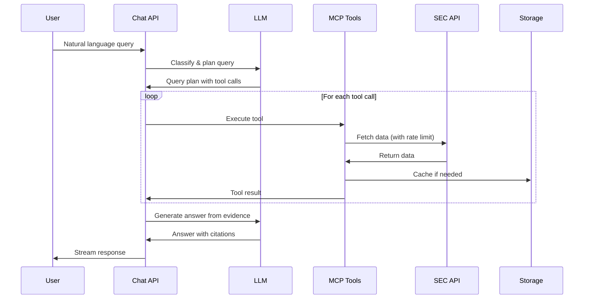
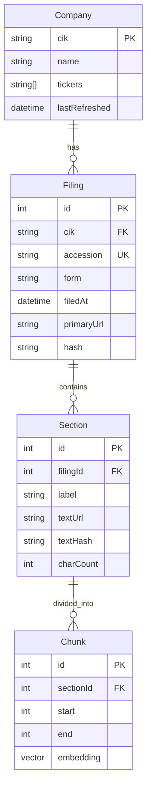

# EDGAR Answer Engine - Architecture Reference

## System Architecture Overview

```
┌─────────────────────────────────────────────────────────────┐
│                         Browser                              │
│                    Next.js App Router                        │
│                     Vercel AI SDK UI                         │
└─────────────────┬───────────────────────────────────────────┘
                  │
┌─────────────────▼───────────────────────────────────────────┐
│                    /api/chat Endpoint                        │
│                  Tool-calling Orchestration                  │
│                         Streaming                            │
└─────────────────┬───────────────────────────────────────────┘
                  │
┌─────────────────▼───────────────────────────────────────────┐
│                    Query Processing Layer                    │
│  ┌─────────────────────────────────────────────────────┐   │
│  │ Query Router     │ Plan Builder    │ Entity Resolver│   │
│  └─────────────────────────────────────────────────────┘   │
└─────────────────┬───────────────────────────────────────────┘
                  │
┌─────────────────▼───────────────────────────────────────────┐
│                      MCP Tool Layer                          │
│  ┌─────────────────────────────────────────────────────┐   │
│  │ resolve_company │ list_filings │ fetch_filing      │   │
│  │ extract_sections│ search_text  │ xbrl_facts        │   │
│  └─────────────────────────────────────────────────────┘   │
└─────────────────┬───────────────────────────────────────────┘
                  │
┌─────────────────▼───────────────────────────────────────────┐
│                   Retrieval Layer (3 Lanes)                  │
│  ┌─────────────────────────────────────────────────────┐   │
│  │ Lane 1: Official Structured APIs                    │   │
│  │ Lane 2: Index Enumerate + Fetch & Scan              │   │
│  │ Lane 3: Optional Full-text Discovery                │   │
│  └─────────────────────────────────────────────────────┘   │
└─────────────────┬───────────────────────────────────────────┘
                  │
┌─────────────────▼───────────────────────────────────────────┐
│                    Processing Pipeline                       │
│  ┌─────────────────────────────────────────────────────┐   │
│  │ Parser → Sectionizer → Chunker → Embedder → Ranker │   │
│  └─────────────────────────────────────────────────────┘   │
└─────────────────┬───────────────────────────────────────────┘
                  │
┌─────────────────▼───────────────────────────────────────────┐
│                      Storage Layer                           │
│  ┌──────────────┬────────────────┬────────────────────┐   │
│  │  PostgreSQL  │  pgvector      │  Vercel Blob      │   │
│  │  + Prisma    │  Embeddings    │  Filing Text      │   │
│  └──────────────┴────────────────┴────────────────────┘   │
└─────────────────┬───────────────────────────────────────────┘
                  │
┌─────────────────▼───────────────────────────────────────────┐
│                   Infrastructure Services                    │
│  ┌──────────────┬────────────────┬────────────────────┐   │
│  │ Upstash Redis│  Vercel Cron   │  Rate Limiter     │   │
│  │  (Queue)     │  (Maintenance) │  (Token Bucket)   │   │
│  └──────────────┴────────────────┴────────────────────┘   │
└──────────────────────────────────────────────────────────────┘
```

## Core Components

### 1. Query Classification System

The system classifies queries into four types:

| Query Type | Description | Example | Primary Tools |
|------------|-------------|---------|---------------|
| **Metadata** | Queries about filing metadata | "Last 10 filings from NVDA" | `list_filings` |
| **Content** | Text search within filings | "Goodwill impairment in MD&A" | `search_text`, `extract_sections` |
| **Hybrid** | Metadata filter + content search | "8-K corrections on revenue in last 6 months" | All tools combined |
| **Numeric/XBRL** | Structured financial data | "Q/Q revenue change for AAPL" | `xbrl_facts` |

### 2. Data Flow



### 3. SEC Data Sources

#### Official Endpoints

| Endpoint | URL Pattern | Purpose | Rate Limit |
|----------|-------------|---------|------------|
| **Submissions** | `data.sec.gov/submissions/CIK{10-digit}.json` | Company filing history | 10 req/sec |
| **Company Facts** | `data.sec.gov/api/xbrl/companyfacts/CIK{10-digit}.json` | All XBRL facts for company | 10 req/sec |
| **Frames** | `data.sec.gov/api/xbrl/frames/{taxonomy}/{tag}/{unit}/{period}.json` | Cross-company metrics | 10 req/sec |
| **Archives** | `www.sec.gov/Archives/edgar/data/{cik}/{accession}/{document}` | Actual filing documents | 10 req/sec |
| **Indexes** | `www.sec.gov/Archives/edgar/daily-index/` | Daily filing lists | 10 req/sec |
| **Ticker Mapping** | `www.sec.gov/files/company_tickers.json` | Ticker to CIK mapping | Daily refresh |

#### Data Formats

- **HTML**: Primary format for newer filings (2000+)
- **TXT**: Plain text format, available for all filings
- **XML/XBRL**: Structured data for financial statements
- **PDF**: Exhibits and older documents (OCR out of scope)

### 4. Sectionizer Patterns

#### 10-K/10-Q Sections

| Item | Section Label | Pattern |
|------|---------------|---------|
| 1 | Business | `Item\s+1\.?\s+Business` |
| 1A | Risk Factors | `Item\s+1A\.?\s+Risk\s+Factors` |
| 2 | Properties | `Item\s+2\.?\s+Properties` |
| 3 | Legal Proceedings | `Item\s+3\.?\s+Legal\s+Proceedings` |
| 7 | MD&A | `Item\s+7\.?\s+Management['']s\s+Discussion` |
| 7A | Market Risk | `Item\s+7A\.?\s+Quantitative.*Market\s+Risk` |
| 8 | Financial Statements | `Item\s+8\.?\s+Financial\s+Statements` |
| 9A | Controls | `Item\s+9A\.?\s+Controls\s+and\s+Procedures` |

#### 8-K Event Items

| Item | Event Type | Importance |
|------|------------|------------|
| 1.01 | Entry into Material Agreement | High |
| 2.02 | Results of Operations | High |
| 4.01 | Changes in Accountant | Critical |
| 4.02 | Non-Reliance on Financial Statements | Critical |
| 5.02 | Officer Departure/Appointment | Medium |
| 7.01 | Regulation FD Disclosure | Low |
| 8.01 | Other Events | Variable |

### 5. Search & Ranking Algorithm

#### Hybrid Scoring Formula

```
final_score = α * bm25_score + β * vector_score + γ * section_boost

where:
- α = 0.4 (keyword weight)
- β = 0.4 (semantic weight)  
- γ = 0.2 (section relevance weight)
```

#### Section Boost Factors

| Query Topic | Boosted Sections | Boost Factor |
|-------------|------------------|--------------|
| Financial metrics | Financial Statements, Notes | 2.0x |
| Risk-related | Risk Factors, Legal Proceedings | 1.8x |
| Business operations | MD&A, Business | 1.5x |
| Governance | Controls, Governance | 1.5x |
| Forward-looking | MD&A, Risk Factors | 1.3x |

### 6. RAG Pipeline

#### Chunking Strategy

```typescript
interface ChunkingParams {
  chunkSize: 1500,        // Target chunk size in characters
  overlap: 200,           // Overlap between chunks
  sentenceBoundary: true, // Try to break at sentences
  maxChunkSize: 2000,     // Hard limit
  minChunkSize: 500,      // Minimum viable chunk
}
```

#### Evidence Selection

1. **Initial Retrieval**: Top 100 chunks by hybrid score
2. **Re-ranking**: Apply cross-encoder model
3. **Diversity**: Ensure multiple sections represented
4. **Final Selection**: Top 5-10 chunks with offsets

#### Citation Format

```typescript
interface Citation {
  filingUrl: string;      // SEC archive URL
  accession: string;      // Filing identifier
  form: string;           // Form type
  filedAt: string;        // Filing date
  section: string;        // Section label
  startChar: number;      // Character offset start
  endChar: number;        // Character offset end
  snippet: string;        // Quoted text
}
```

### 7. Database Schema Details

#### Table Relationships



#### Indexes

- `companies`: `(name)`, `(tickers)` - Fast company lookup
- `filings`: `(cik, filedAt)`, `(form, filedAt)` - Date range queries
- `sections`: `(filingId, label)` - Section retrieval
- `chunks`: `(sectionId)`, `embedding` - Vector similarity search

### 8. API Contracts

#### POST /api/chat

**Request:**
```typescript
{
  messages: Array<{
    role: 'user' | 'assistant' | 'system';
    content: string;
  }>;
  stream?: boolean;
}
```

**Response (Streaming):**
```typescript
// JSONLines format
{"type": "tool_call", "name": "resolve_company", "arguments": {...}}
{"type": "tool_result", "name": "resolve_company", "result": {...}}
{"type": "content", "text": "Based on the analysis..."}
{"type": "citation", "data": {...}}
{"type": "done"}
```

#### GET /api/filings/[cik]

**Query Parameters:**
- `limit`: Number of filings (default: 10)
- `forms`: Comma-separated form types
- `since`: ISO date string
- `until`: ISO date string

**Response:**
```typescript
{
  company: {
    cik: string;
    name: string;
    tickers: string[];
  };
  filings: Array<{
    accession: string;
    form: string;
    filedAt: string;
    primaryUrl: string;
    size: number;
  }>;
}
```

### 9. Performance Specifications

#### Latency Targets

| Operation | P50 | P95 | P99 |
|-----------|-----|-----|-----|
| Company resolution | 100ms | 300ms | 500ms |
| List filings | 200ms | 500ms | 1s |
| Fetch filing | 500ms | 2s | 5s |
| Section extraction | 100ms | 300ms | 500ms |
| Text search (per filing) | 200ms | 500ms | 1s |
| Full query (simple) | 2s | 5s | 10s |
| Full query (complex) | 5s | 15s | 30s |

#### Scalability Limits

- **Concurrent users**: 1000 (Vercel serverless auto-scales)
- **Rate limit**: 10 req/sec to SEC (global)
- **Database connections**: 100 (connection pooling)
- **Blob storage**: 1TB monthly transfer
- **Vector dimensions**: 1536 (OpenAI ada-002)
- **Max chunks per search**: 10,000

### 10. Security Considerations

#### Input Validation

- All user inputs sanitized with Zod schemas
- SQL injection prevented via Prisma parameterized queries
- XSS prevention in HTML parsing
- Rate limiting on all endpoints

#### Data Privacy

- No PII stored beyond public filing data
- Temporary filing storage with TTL
- No user data persistence
- Audit logs contain only public identifiers

#### API Security

- CORS configured for specific origins
- API routes require authentication (in production)
- Environment variables for sensitive config
- No direct database access from client

### 11. Monitoring & Observability

#### Key Metrics

```typescript
interface Metrics {
  // Availability
  uptime: number;                    // Target: 99.9%
  errorRate: number;                 // Target: <1%
  
  // Performance
  queryLatencyP95: number;           // Target: <5s
  secApiLatency: number;             // Track SEC responsiveness
  
  // Usage
  dailyActiveUsers: number;
  queriesPerDay: number;
  secApiCallsPerDay: number;        // Monitor rate limit usage
  
  // Quality
  citationAccuracy: number;          // Target: >95%
  querySuccessRate: number;         // Queries with results
}
```

#### Logging Structure

```typescript
interface LogEntry {
  timestamp: string;
  level: 'debug' | 'info' | 'warn' | 'error';
  operation: string;
  duration?: number;
  toolName?: string;
  secUrl?: string;
  error?: string;
  correlationId: string;
}
```

### 12. Deployment Architecture

#### Vercel Configuration

```json
{
  "functions": {
    "app/api/chat/route.ts": {
      "runtime": "nodejs20.x",
      "maxDuration": 60,
      "memory": 1024
    },
    "app/api/filings/[cik]/route.ts": {
      "runtime": "nodejs20.x",
      "maxDuration": 10,
      "memory": 512
    }
  },
  "regions": ["iad1"],
  "env": {
    "NODE_ENV": "production"
  }
}
```

#### Infrastructure as Code

```typescript
// Infrastructure components
const infrastructure = {
  compute: "Vercel Serverless Functions",
  database: "Neon PostgreSQL with pgvector",
  cache: "Upstash Redis (Global)",
  storage: "Vercel Blob Storage",
  cdn: "Vercel Edge Network",
  monitoring: "Vercel Analytics + Custom Metrics",
  secrets: "Vercel Environment Variables"
};
```

### 13. Cost Optimization

#### Resource Usage Estimates

| Resource | Usage | Monthly Cost |
|----------|-------|--------------|
| Vercel Pro | Hosting + Functions | $20 |
| Neon DB | 10GB storage + compute | $25 |
| Upstash Redis | 10K commands/day | $10 |
| OpenAI API | 1M tokens/day | $30 |
| Vercel Blob | 100GB storage | $10 |
| **Total** | | **~$95/month** |

#### Optimization Strategies

1. **Cache aggressively**: Cache company resolutions (24hr), common queries (1hr)
2. **Batch operations**: Group SEC API calls when possible
3. **Progressive loading**: Stream results as available
4. **Smart indexing**: Only index frequently accessed companies
5. **TTL management**: Auto-cleanup old data

### 14. Disaster Recovery

#### Backup Strategy

- **Database**: Daily automated backups (7-day retention)
- **Code**: Git repository with tagged releases
- **Configuration**: Environment variables in Vercel dashboard
- **Filing cache**: Ephemeral, can be rebuilt from SEC

#### Recovery Procedures

1. **Service outage**: Auto-failover via Vercel regions
2. **Database failure**: Restore from snapshot (<1hr RTO)
3. **SEC API down**: Queue requests, serve from cache
4. **Rate limit hit**: Exponential backoff, user notification

### 15. Future Architecture Considerations

#### Potential Enhancements

1. **Multi-region deployment**: Reduce latency globally
2. **Edge caching**: Cache common queries at edge
3. **Streaming LLM**: Reduce time to first byte
4. **Webhook updates**: Real-time filing notifications
5. **Batch API**: Process multiple queries efficiently

#### Scaling Considerations

```typescript
interface ScalingPlan {
  phase1: {
    users: 1000,
    infrastructure: "Current architecture",
    cost: "$100/month"
  },
  phase2: {
    users: 10000,
    infrastructure: "+ Read replicas, CDN",
    cost: "$500/month"
  },
  phase3: {
    users: 100000,
    infrastructure: "+ Multi-region, dedicated compute",
    cost: "$5000/month"
  }
}
```

---

*This architecture reference should be used alongside PROJECT_ROADMAP.md for implementation timeline and DEVELOPMENT_GUIDE.md for code details.*